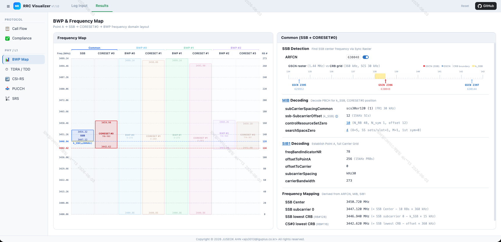
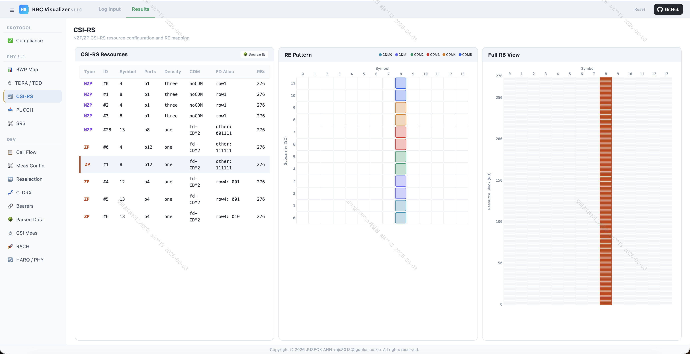

# 📡 NR RRC Visualizer

A web-based tool that parses 5G NR RRC messages and visualizes PHY configuration. Built to assist engineers analyzing radio network parameters from multi-vendor chipset logs.

---

## 💡 Why This Tool?

Analyzing 5G NR RRC messages means cross-referencing dozens of parameters scattered across MIB, SIB1, rrcSetup, and rrcReconfiguration. Each requires understanding 3GPP spec formulas and chaining values in different units. On top of that, chipset vendors (Qualcomm, Samsung, Wireshark) use completely different log formats.

This tool bridges that gap by:
- **Auto-detecting** vendor format and parsing into a unified structure
- **Merging** multiple RRC messages while tracking the source IE path of every parameter
- **Visualizing** frequency domain layout, time domain allocation, RE-level resource mapping, and protocol sequences — all from a single log input

---

## ✨ Key Features

- **Multi-Vendor Parser** — Wireshark, Qualcomm QXDM, Samsung Shannon DM (auto-detected)
- **BWP & Frequency Map** — Point A → SSB → CORESET#0 → BWP layout with GSCN raster diagram
- **TDRA / TDD** — SLIV decoding + 14-symbol slot visualization + TDD UL/DL pattern
- **Call Flow** — NR RRC / NAS message sequence diagram with encrypted NAS direction inference
- **CSI-RS / PUCCH / SRS** — RE-level resource mapping with CDM group visualization
- **Compliance Check** — Security, Power Saving, VoNR compliance dashboard (Pass/Fail/Pending)
- **DM Log Support** — Upload .qmdl/.hdf/.dlf/.sdm → auto-convert to PCAP via scat
- **Session Save/Load** — Save full analysis state as .zip, restore anytime
- **Source IE Tree** — Track exactly which message and IE path each parameter came from
- **Responsive UI** — Desktop grid + mobile swipe, Light/Dark theme

---

## 🌐 Online Demo

**[Try Online Demo](https://nr-rrc-visualizer.onrender.com)**

---

## 💻 Run Locally

Download the latest release from [Releases](https://github.com/joostone-ahn/nr-rrc-visualizer-releases/releases/latest).

1. Download `NR-RRC-Visualizer-vX.X.X.exe`
2. Double-click to run

> **First run:** WSL2, usbipd, Node.js, scat, tshark are installed automatically (may require reboot).  
> **Subsequent runs:** Instant startup.  
> A `nr-rrc-visualizer-linux` file is created next to the exe — do not delete it.

---

## 📖 How to Use

See the User Guide for detailed instructions:
- [English](https://github.com/joostone-ahn/nr-rrc-visualizer-releases/blob/main/manual/user-guide-en.md)
- [한국어](https://github.com/joostone-ahn/nr-rrc-visualizer-releases/blob/main/manual/user-guide-kr.md)

---

## 📋 Change History

| Version | Date | Changes |
|---------|------|---------|
| v1.2.0 | 2026-06-03 | Native run scripts (macOS/Windows WSL) |
| v1.1.0 | 2026-05-27 | Parser architecture refactoring, PUCCH view improvements (RB Map colors/Hop display), ARFCN toggle fix |
| v1.0.3 | 2026-05-26 | BWP Map: ARFCN auto-apply (A3 measObject), parser field scope improvement |
| v1.0.2 | 2026-05-25 | BWP Map: multi-message sourceIE accumulation, CORESET#0 display fix, chart grid improvement |
| v1.0.1 | 2026-05-18 | VoNR C-DRX Compliance verification logic fix |
| v1.0.0 | 2026-05-15 | Initial release |

---

## 👤 Author

**JUSEOK AHN (안주석)**  
**Email**: ajs3013@lguplus.co.kr  
**Organization**: LG U+

---

## 📄 License

© 2026 JUSEOK AHN <ajs3013@lguplus.co.kr>. All rights reserved.

This software is provided free of charge for personal and internal use.
You may not modify, distribute, sublicense, or sell copies of this software
without explicit written permission from the author.

Relies on [tshark](https://www.wireshark.org/) (GPL-2.0) and [scat](https://github.com/fgsect/scat) (GPL-2.0) as external subprocesses.
